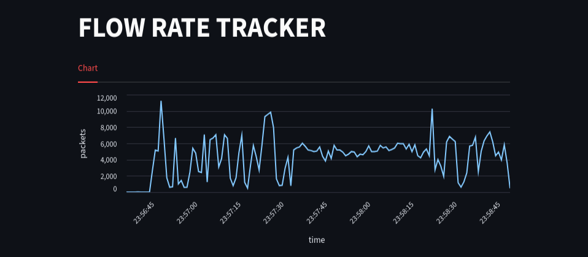

# PACKETS FLOW RATE TRACKER APP
This tool helps users visually see the number of packets being sent to their computer from outside

## Demo
- This chart show number of packets has been send to victim computer in a mini DoS attack.


## Features
- This creates a more visual overview of the number of packets entering the computer.
- Supporting in research on denial-of-service attacks.

## Installation
- First clone this repo, by using terminal:
```
git clone git@github.com:khainguyendiep/packets_flow_rate_tracker.git
```
- Then, installing the streamlit library for visualize:
``` 
pip install -r requirements.txt
```
## Usage 
- The application need a file log to read the input, example file log has path like that:
```
/var/log/packets_flow_rate_tracker/packets_flow_rate_tracker.log
```
- At the terminal, run:
```
make
```
- To start capture packets, using this command (sudo is needed to gain access to the network cards):
```
sudo ./packets_flow_rate_tracker
```
- Choosing the desired interface (do not use ```lo```), by enter the number corresponding to the listed interface (It is recommended to choose ```eth0``` or ```wlan0```). 
- Finally, to start the app, open another terminal and run this command:
```
streamlit run app/app.py
```
## Contributing

Please **DO NOT** push directly into `master` branch.

All contributions must be made via pull request from your own branch.

See detailed instructions at [contributing.md](./contributing.md)

## License

MIT © [khainguyendiep](https://github.com/khainguyendiep)
